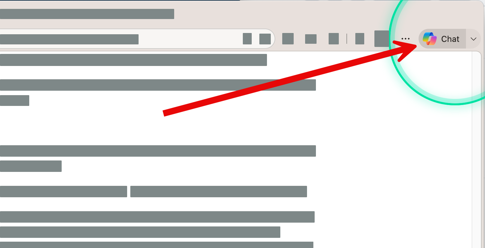

# Part 1 — Create better prompts

## Exercise

พวกเราจะมาฝึกเขียน prompt สำหรับ **Copilot in Edge** โดยเติมข้อมูลทีละชั้น: **Goal**, **Context**, **Source**, และ **Expectations**. 

พลอยากให้นึกถึงการสั่งอาหาร: 
- Goal คือเมนูที่ต้องการ
- Context คือรายละเอียดความชอบของคนกิน
- Source คือวัตถุดิบที่อนุญาตให้ใช้
- และ Expectations คือหน้าตาอาหารที่อยากได้ตอนเสิร์ฟ

## Scenario

คุณกำลังเตรียมสรุปประเด็นจากหน้าเว็บให้ทีมผู้บริหาร ใช้หน้า [Get started writing prompts in Microsoft 365 Copilot](https://support.microsoft.com/en-us/microsoft-365-copilot/get-started-writing-prompts-in-microsoft-365-copilot) เป็นแหล่งข้อมูลสาธารณะสำหรับการฝึก และเตรียมพื้นที่สำหรับบันทึกผลของแต่ละรอบ

ใช้ [worksheet](../../files/part-1/prompt-comparison-worksheet.docx) ที่เตรียมไว้เป็น template ได้ หรือใช้เครื่องมือที่ถนัด เช่น Word, OneNote, Loop, Excel, Google Docs, Notion หรือไฟล์ข้อความธรรมดา ให้เลือกใช้แอพใดแอพหนึ่ง สำหรับเปรียบเทียบผลที่ได้จาก Practice 1-4 โดยบันทึก prompt ที่ใช้, คำตอบจาก Copilot

ดาวน์โหลดไฟล์ตัวอย่างทั้งหมดของ Part 1 ได้ที่ [part-1-sample-files.zip](https://github.com/teerasej/work-smarter-with-ai-1/raw/main/files/part-1/part-1-sample-files.zip) แล้วแตกไฟล์ zip ก่อนเริ่มทำแบบฝึกหัด

## Practice 1 — Goal

**Prerequisites:** เปิดหน้าเว็บอ้างอิงใน Microsoft Edge และลงชื่อเข้าใช้ Copilot in Edge ถ้ามี
    
**Primary target:** บอกงานที่ต้องการให้ชัดเจน

**Steps:**

1. ใน Copilot in Edge ส่ง prompt:

    ```text
    ช่วยสรุปเนื้อหาในหน้าเว็บนี้ให้หน่อย
    ```
2. คัดลอกหรือบันทึกคำตอบลงแอพที่เลือกไว้ หรือใช้ templateในช่องหรือหัวข้อ Practice 1
3. จดสิ่งที่ยังไม่ชัดเจนในคำตอบ

**Checkpoint / expected output:** ได้บทสรุปแรกที่ระบุสาระของหน้าเว็บ และเห็นว่าคำว่า “สรุป” ยังเปิดกว้าง

**Fallback:** หากไม่มี Copilot in Edge ให้คัดลอกข้อความสำคัญจากหน้าเว็บไปวางใน Copilot Chat แล้วใช้ prompt เดิม พร้อมระบุว่าเป็นข้อความที่วางไว้

## Practice 2 — Goal + Context

**Prerequisites:** มีผลจาก Practice 1 ในแอพที่เลือกไว้ หรือใช้ template

**Primary target:** ให้ Copilot รู้สถานการณ์และผู้รับสาร

**Steps:**

1. ส่ง prompt:

    ```text
    ช่วยสรุปเนื้อหาในหน้าเว็บนี้ให้หน่อย เพราะกำลังเตรียมตัวเข้าประชุมกับทีมผู้บริหาร และต้องการเข้าใจเนื้อหาสำคัญที่อาจมีผลต่อการทำธุรกิจ เอาแบบเร็วๆ
    ```
2. บันทึกคำตอบลงแอพที่เลือกไว้ หรือใช้ template
3. เปรียบเทียบสิ่งที่เปลี่ยนจาก Practice 1 โดยเฉพาะน้ำหนักของประเด็นเรื่องการทำธุรกิจ

**Checkpoint / expected output:** ได้สรุปที่เลือกประเด็นโดยคำนึงถึงการนำไปใช้กับการประชุมผู้บริหาร

**Fallback:** ใช้ Copilot Chat พร้อมข้อความหน้าเว็บที่วางไว้ และระบุ Context เดียวกัน

## Practice 3 — Goal + Context + Source


**Primary target:** จำกัดหลักฐานที่ Copilot ใช้ และสังเกตการอ้างอิงข้อมูล

**Steps:**

1. ส่ง prompt:

    ```text
    ช่วยสรุปเนื้อหาในหน้าเว็บนี้ให้หน่อย เพราะกำลังเตรียมตัวเข้าประชุมกับทีมผู้บริหาร และต้องการเข้าใจเนื้อหาสำคัญที่อาจมีผลต่อการทำธุรกิจ เอาแบบเร็วๆ
    
    ให้ใช้ข้อมูลจากหน้าเว็บที่กำลังเปิดอยู่ใน Edge นี้เป็นหลัก หากข้อมูลสำคัญบางอย่างไม่มีอยู่ในหน้าเว็บนี้ ให้ระบุว่าไม่พบข้อมูล แทนการคาดเดา
    ```
2. บันทึกคำตอบและหลักฐานที่ Copilot กล่าวถึงในแอพที่เลือกไว้ หรือใช้ template
3. ทำเครื่องหมายข้อที่ไม่พบข้อมูลหรือควรตรวจสอบต่อ

**Checkpoint / expected output:** ได้คำตอบที่แยกข้อมูลจากหน้าเว็บออกจากสิ่งที่ไม่มีหลักฐานรองรับ

**Fallback:** วางข้อความหน้าเว็บลง Copilot Chat แล้วแทนคำว่า “หน้าเว็บที่กำลังเปิด” ด้วย “ข้อความที่วางไว้ด้านล่าง”

## Practice 4 — Goal + Context + Source + Expectations

**Prerequisites:** มีผลจาก Practice 3

**Primary target:** กำหนดรูปแบบผลลัพธ์ที่นำไปใช้ต่อได้

**Steps:**

1. ส่ง prompt เดิมจาก Practice 3 แล้วเติม:

    ```text
    ช่วยสรุปเนื้อหาในหน้าเว็บนี้ให้หน่อย เพราะกำลังเตรียมตัวเข้าประชุมกับทีมผู้บริหาร และต้องการเข้าใจเนื้อหาสำคัญที่อาจมีผลต่อการทำธุรกิจ เอาแบบเร็วๆ

    ให้ใช้ข้อมูลจากหน้าเว็บที่กำลังเปิดอยู่ใน Edge นี้เป็นหลัก หากข้อมูลสำคัญบางอย่างไม่มีอยู่ในหน้าเว็บนี้ ให้ระบุว่าไม่พบข้อมูล แทนการคาดเดา

    ตอบเป็นภาษาไทยแบบเข้าใจง่าย โดยจัดเป็น: (1) สรุป 5 ข้อ (2) ผลกระทบต่อธุรกิจ 3 ข้อ (3) ความเสี่ยงหรือข้อควรระวัง (4) คำถามต่อเนื่องกับเนื้อหานี้เพื่อเปิดประเด็น 3 ข้อ
    ```
2. บันทึกผลลัพธ์สุดท้ายลงแอพที่เลือกไว้ หรือใช้ template
3. เขียน reflection ว่าส่วนใดของ prompt เปลี่ยนคุณภาพคำตอบมากที่สุด และเพราะอะไร

**Checkpoint / expected output:** ได้ brief ที่มีโครงสร้างสำหรับนำไปคุยต่อ พร้อมคำถามติดตามที่ตรวจสอบได้

**Fallback:** ใช้ Copilot Chat พร้อมข้อความหน้าเว็บที่วางไว้ และขอรูปแบบผลลัพธ์เดียวกัน

## Further learning

- [Microsoft Support: Get started writing prompts in Microsoft 365 Copilot](https://support.microsoft.com/en-us/microsoft-365-copilot/get-started-writing-prompts-in-microsoft-365-copilot)
- [Microsoft Learn: Write effective prompts and do more with prompting](https://learn.microsoft.com/en-us/training/modules/write-effective-prompts-do-more-prompting/)
