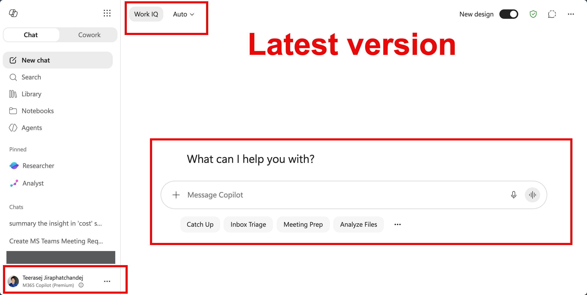
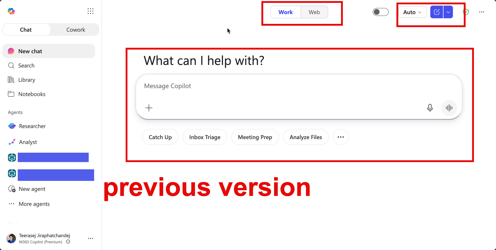
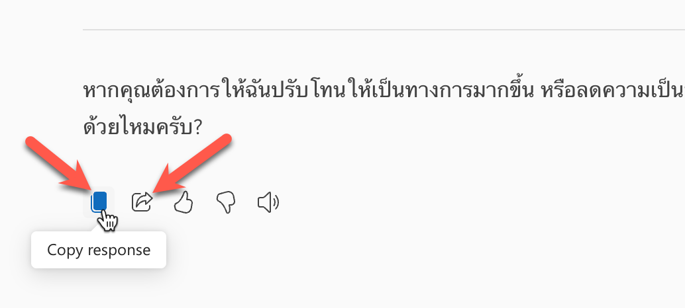
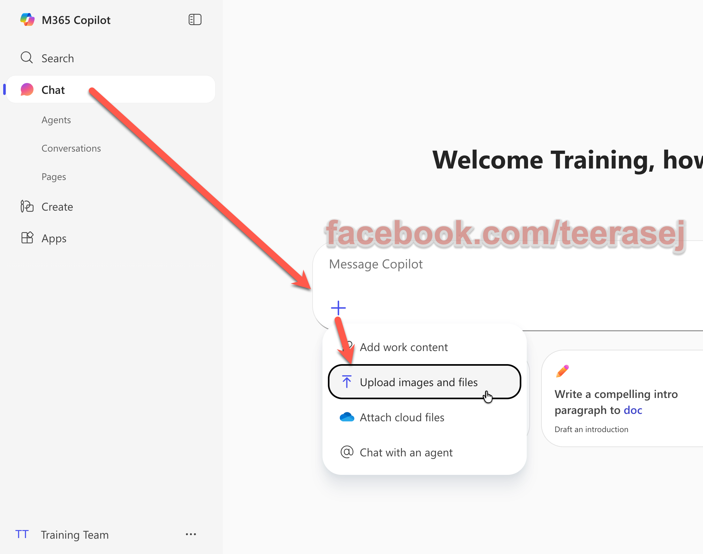

# Exercise: เริ่มต้นใช้ Copilot Chat แบบ Web-grounded

## Exercise Overview

เราจะใช้ Copilot Chat เพื่อร่างข้อความ ค้นข้อมูลจาก Web และทำงานกับไฟล์ที่แนบ โดยฝึกตรวจสอบคำตอบก่อนนำไปใช้งาน

## Prerequisites

1. ลงชื่อเข้าใช้ [Microsoft 365 Copilot](https://m365copilot.com/) ด้วยบัญชีองค์กร
2. ดาวน์โหลด `Expenses_Policy.pdf` จากชุดไฟล์ workshop ไว้ในเครื่อง หรือมีการอัพโหลดไฟล์นี้ไปยัง OneDrive แล้ว
3. หากหน้าจอมีปุ่ม **Work IQ** ให้ปิดปุ่มนี้สำหรับกิจกรรม Web-grounded

> Copilot Chat แบบ Basic ใช้ข้อมูลจาก Web เป็นพื้นฐาน หากต้องการใช้ข้อมูลองค์กรในกิจกรรมนี้ เราต้องแนบไฟล์หรือวางข้อมูลลงใน prompt โดยตรง




## Scenario 1: ใช้ Copilot Chat ช่วยงานประจำวัน

## Practice 1: ร่างและปรับ Email

#### Steps

1. เปิด Chat ใหม่
2. วาง prompt ด้านล่าง แล้วกด **Send**

```text
ร่าง Email ภาษาไทยถึงคุณสมศรีเพื่อขอนัดคุยเรื่องงบประมาณโครงการสินค้าใหม่ เวลา 10.00 น.
ใช้โทนสุภาพและเป็นมืออาชีพ ความยาวไม่เกิน 120 คำ
หากข้อมูลสำคัญไม่ครบ ให้ใส่ [ต้องระบุ] แทนการคาดเดา
```

3. ตรวจแบบร่าง แล้วถามต่อเพื่อปรับรูปแบบ

```text
ปรับแบบร่างให้กระชับขึ้น
จัดเป็นหัวข้อ: วัตถุประสงค์ วันที่และเวลา สิ่งที่ต้องเตรียม และช่องทางตอบกลับ
```

4. เปรียบเทียบคำตอบทั้งสองรอบ แล้วคัดลอกฉบับที่เหมาะสม



## Practice 2: ค้นข้อมูลจาก Web และกลับมาที่ Chat History

#### Steps

1. เปิด Chat ใหม่
2. ใช้ prompt ด้านล่างในห้องแชท และแทนที่ `[องค์กร]` ด้วยชื่อองค์กรที่ต้องการศึกษา แล้วส่ง prompt

```text
ค้นหาข่าวสำคัญเกี่ยวกับ [องค์กร] ที่เผยแพร่ในปี 2026
สรุป 3 เรื่อง โดยใส่วันที่ แหล่งที่มา และ link สำหรับตรวจสอบ
แยกข้อเท็จจริงออกจากความคิดเห็น
```

3. เปิดแหล่งที่มาอย่างน้อย 1 รายการ และตรวจวันที่กับเนื้อหาต้นฉบับ
4. เลือก Chat ก่อนหน้าจาก **Chat History** เพื่อกลับไปดูแบบร่าง Email


### Extended use case: สืบค้นข้อมูลสินค้าของคู่แข่ง

ใช้ Chat เดิมหรือเปิด Chat ใหม่ เพื่อค้นข้อมูลสินค้าคู่แข่งจาก Web แล้วตรวจสอบแหล่งที่มาก่อนนำไปวิเคราะห์

```text
สืบค้นข้อมูลสินค้าแชมพูคู่แข่ง
ตัวอย่างสินค้า: Klorane Shampoo with Quinine and Organic Edelweiss หรือแชมพูเฉพาะทางจากยุโรปที่มีข้อมูลออนไลน์น่าเชื่อถือ

สรุปเป็นตาราง 5 คอลัมน์:
ชื่อสินค้า | ประเทศหรือภูมิภาคที่จำหน่าย | จุดขายหรือ claim หลัก | ราคา/ขนาดบรรจุภัณฑ์ที่พบ | แหล่งที่มาและ link

ขอข้อมูลอย่างน้อย 3 แหล่ง โดยเน้นเว็บไซต์ทางการ ร้านค้าปลีกที่น่าเชื่อถือ หรือรีวิวจากแหล่งที่ตรวจสอบได้
แยก “ข้อเท็จจริงจากแหล่งที่มา” ออกจาก “ข้อสังเกต/ข้อคิดเห็น”
หากไม่พบราคา ขนาด หรือประเทศที่จำหน่าย ให้ระบุว่า "ไม่พบข้อมูล"
```

## Practice 3: Working with File

#### Steps

1. เปิด Chat ใหม่
2. เลือกปุ่ม **+** แล้วเลือก **Upload images or files**
3. อัพโหลด `Expenses_Policy.pdf`



4. วาง prompt ด้านล่าง แล้วกด **Send**

```text
จากไฟล์ที่แนบมา สรุปค่าใช้จ่ายที่เบิกได้สูงสุด 3 ประเภท
จัดเป็นตาราง: ประเภทค่าใช้จ่าย | วงเงิน | เงื่อนไข | หน้าหรือหัวข้ออ้างอิง
หากข้อมูลไม่ปรากฏในไฟล์ ให้ระบุว่า "ไม่พบข้อมูล"
```

5. เปิดไฟล์ต้นทางและตรวจวงเงินอย่างน้อย 2 รายการ

> File upload ใน Copilot Chat แบบ Basic เป็น standard access และอาจมีข้อจำกัดตามความพร้อมของบริการ

## Practice 4: สร้างภาพประกอบแคมเปญโปรแชมพูด้วย Copilot Create

ในกิจกรรมนี้ เราจะสร้างภาพประกอบสำหรับการสื่อสารภายในองค์กรเกี่ยวกับแคมเปญโปรโมชันแชมพู โดยเน้นภาพที่นำไปใช้ใน Newsletter, Teams post หรือสไลด์ประชุมภายในได้

#### Steps

1. กดเลือกเมนู **Create** ที่ซ่อนอยู่ด้านบนของเมนู


2. จากรายการไอเดียด้านบน ให้เลือก **Create an Image**
3. ในช่อง Prompt Box ให้ copy prompt ด้านล่างไปวาง เพื่อกำหนดภาพประกอบแคมเปญ

   ```text
   a modern campaign room where a team is reviewing shampoo promotion ideas, with generic unbranded shampoo bottles, clean product mockups, fresh botanical hair-care ingredients, and upbeat campaign energy.
   Style: professional corporate illustration, clean pastel blue and green palette, bright lighting, friendly and optimistic, suitable for an internal newsletter, Teams post, or presentation slide.
   Composition: leave clear blank space at the top-left for a Thai headline to be added later.

   Do not include real brand names, logos, competitor products, readable text, pricing, discounts, or medical/clinical claims.
   ```

4. ในช่อง **Add Style** ให้เลือก Style ที่เหมาะกับงานภายในองค์กร เช่น Illustration, Corporate, หรือ Clean Design
5. กดปุ่ม **Create** และรอผลลัพธ์
6. ตรวจภาพที่ได้ โดยดูว่าไม่มี logo จริง ไม่มีข้อความอ่านได้ ไม่มี claim เกินจริง และมีพื้นที่ว่างสำหรับใส่หัวข้อภาษาไทยภายหลัง
7. หากต้องการปรับภาพ ให้ใช้ prompt ต่อเนื่อง เช่น

   ```text
   Revise the image to look more like an internal campaign announcement for a shampoo promotion. Make the shampoo bottles more visible, keep the scene unbranded, use a cleaner pastel background, and preserve blank space for a Thai headline. Remove any readable text or logos.
   ```

8. เมื่อได้ผลลัพธ์ที่เหมาะสมแล้ว กดที่ภาพเพื่อดูภาพขนาดใหญ่ขึ้น หรือกด **Download** เพื่อดาวน์โหลดภาพ

## Checkpoint

- แบบร่าง Email ไม่มีข้อมูลที่ Copilot คาดเดาแทนเรา
- ข่าวจาก Web มีวันที่ แหล่งที่มา และ link ที่เปิดตรวจสอบได้
- ตารางค่าใช้จ่ายอ้างอิงข้อมูลจาก `Expenses_Policy.pdf`
- ภาพแคมเปญโปรแชมพูไม่มี logo จริง ข้อความอ่านได้ หรือ claim ที่ตรวจสอบไม่ได้

## Expected Output

- แบบร่าง Email ที่ปรับแล้ว 1 ฉบับ
- สรุปข่าวพร้อมแหล่งอ้างอิง 3 เรื่อง
- ตารางค่าใช้จ่ายจากไฟล์ 1 ตาราง
- ภาพประกอบแคมเปญโปรแชมพูสำหรับสื่อสารภายในองค์กร 1 ภาพ


