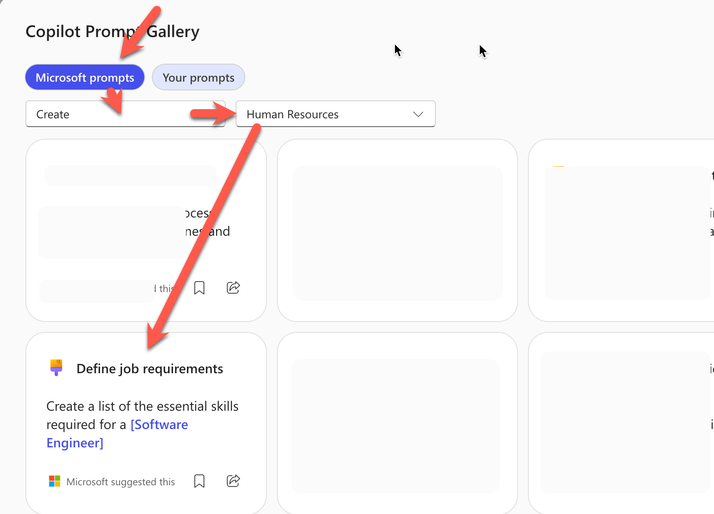
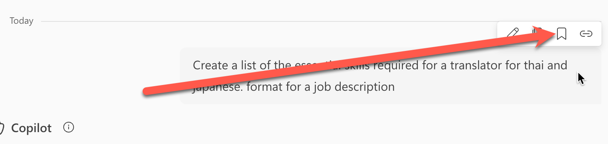
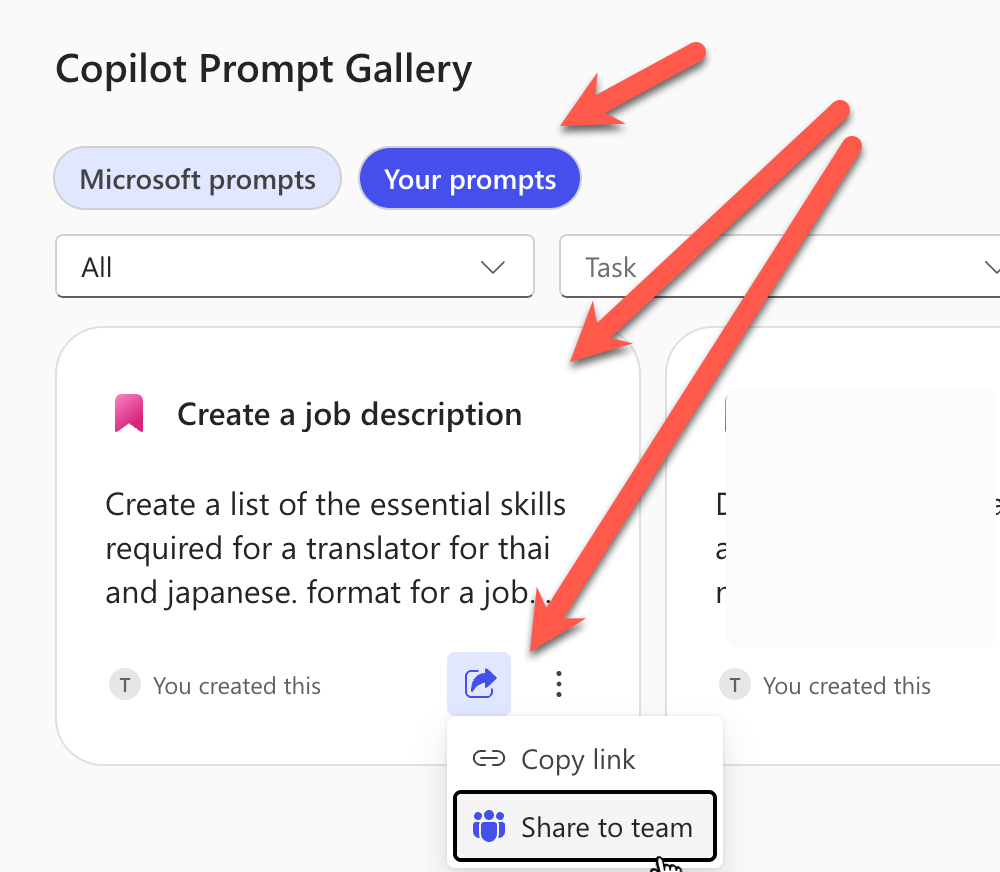

# Exercise: ค้นหา ปรับ บันทึก และแชร์ Prompt ด้วย Prompt Gallery

## Exercise Overview

เราจะเริ่มจาก prompt สำเร็จรูป ปรับให้ตรงกับงานสื่อสารภายในองค์กร บันทึกไว้ใช้ซ้ำ และแชร์กับ Microsoft Teams team

## Prerequisites

1. ลงชื่อเข้าใช้ [Microsoft 365 Copilot](https://m365copilot.com/) ด้วยบัญชีองค์กร
2. เป็นสมาชิก Microsoft Teams team อย่างน้อย 1 team หากต้องการทดลองแชร์

## Scenario 1: สร้าง Prompt สำหรับร่างประกาศบริษัท

## Practice 1: ใช้และปรับ prompt สำเร็จรูป

#### Steps

1. เปิด **Prompt Gallery** จาก Microsoft 365 Copilot
2. เลือกแท็บ **Suggested**
3. กรอง Task เป็น `Create` และเลือก prompt ที่เกี่ยวกับการเขียนประกาศหรือการสื่อสารภายในองค์กร



4. ปรับ prompt ให้เป็นข้อความด้านล่าง แล้วทดลองใช้งาน

```text
Create a company announcement for employees about [หัวข้อประกาศ].
Context: [สรุปเหตุผลหรือความเป็นมาของประกาศ].
Include: announcement title, key message, affected audience, important dates/times, required action, support contact, and a short version for Microsoft Teams.
Use clear, professional, friendly, and inclusive language in Thai.
Mark any missing company-specific detail such as date, policy, location, link, benefit, or contact as [ต้องระบุ] instead of inventing it.
```

5. ตรวจผลลัพธ์และปรับหัวข้อประกาศ, กลุ่มผู้อ่าน, ช่องทางสื่อสาร หรือ format ให้เหมาะกับงานของเรา

## Practice 2: บันทึก Prompt ไว้ใช้ซ้ำ

#### Steps

1. วางเมาส์เหนือ prompt ที่เราส่ง แล้วเลือก **Save prompt**



2. ตั้งชื่อว่า `Create company announcement` แล้วเลือก **Save**
3. เปิด Prompt Gallery และเลือกแท็บ **Your prompts**
4. เปิด prompt ที่บันทึกไว้ และตรวจว่าข้อความครบถ้วน



## Practice 3: แชร์ Prompt กับ team

#### Steps

1. ในแท็บ **Your prompts** วางเมาส์เหนือ prompt ที่ต้องการแชร์
2. เลือก **Share prompt** แล้วเลือก **Share to team**
3. เลือก Microsoft Teams team ที่ใช้สำหรับ workshop
4. เปิดแท็บ **Team prompts** และเลือก team เดิม เพื่อตรวจว่า prompt ปรากฏในรายการ

> หากไม่มี team สำหรับทดลอง ให้หยุดก่อนขั้นตอนแชร์และเก็บ prompt ไว้ใน **Your prompts**

## Checkpoint

- prompt ระบุหัวข้อประกาศ, context, audience, output format และข้อจำกัดครบ
- prompt ที่บันทึกปรากฏใน **Your prompts**
- prompt ที่แชร์ปรากฏใน **Team prompts** ของ team ที่เลือก หรือถูกเก็บเป็น prompt ส่วนตัวเมื่อไม่มี team

## Expected Output

- prompt สำหรับสร้างประกาศบริษัท 1 รายการที่บันทึกและพร้อมใช้ซ้ำ
- prompt ที่แชร์กับ team 1 รายการ หรือ prompt ส่วนตัว 1 รายการตามสิทธิ์ที่มี
