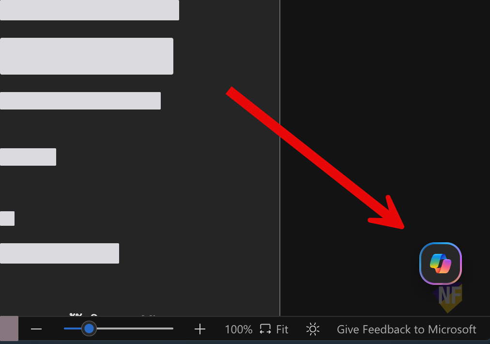
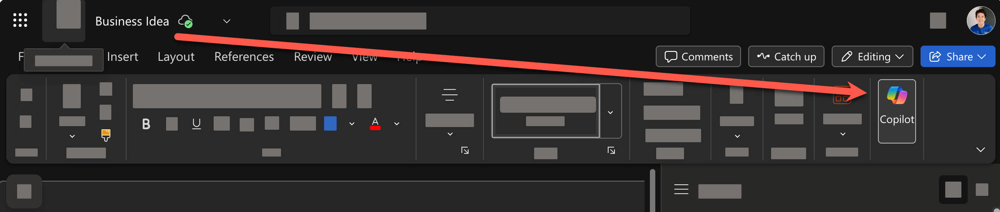
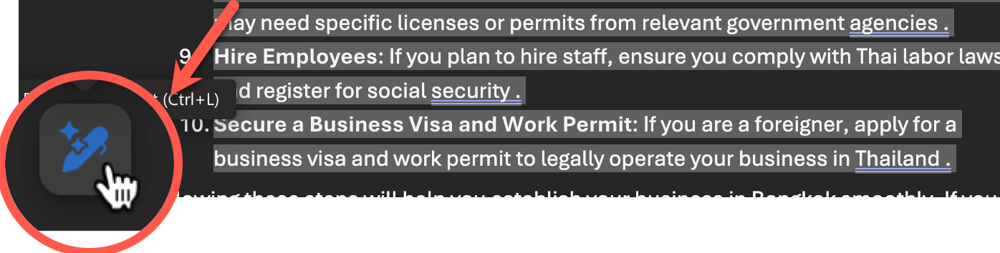

# 1. Word: เรียกใช้ Copilot ผ่าน Microsoft Word

> ในแบบฝึกหัดนี้ การใช้งานจะแตกต่างกันตามประเภทของ Account ที่ใช้งาน Copilot นะครับ


## 1. สรุปข้อมูล หรือให้ Copilot วิเคราะห์เนื้อหาในเอกสาร
1. เปิด OneDrive
2. ไปที่โฟลเดอร์ที่อัพโหลดไฟล์ไว้
3. ให้คลิกขวาที่ไฟล์ word และคลิก **Open > Open in web app** เพื่อเปิดไฟล์เอกสารใน Microsoft Word บนเว็บเบราว์เซอร์
   

4. กดเปิด Copilot โดยคลิกที่ปุ่ม copilot ที่อยู่ด้านล่างขวาของหน้าต่าง Microsoft Word บนเว็บเบราว์เซอร์
   
   > แบบเก่าจะกดเปิดได้จากด้านบนขวาของแถบเครื่องมือ Microsoft Word
   > 
5. สั่งให้ Copilot ช่วยสรุปเนื้อหาในเอกสารให้ โดยใช้คำสั่ง prompt ต่อไปนี้

   ```
   สรุปเนื้อหาสำคัญในเอกสารนี้เป็น 5 หัวข้อ
   ```
   คัดลอกและวาง prompt ด้านบน ในห้องแชท และกดปุ่ม enter หรือปุ่มส่ง
   

6. ตรวจสอบผลลัพธ์ที่ได้จาก Copilot
7. ด้านล่างสุดของคำตอบ กดปุ่ม "Add to Doc" เพื่อแทรกผลลัพธ์ลงในเอกสาร

## 2. จัดเรียงเนื้อหาเป็นตาราง

1. เลือกข้อความที่ขึ้นต้นด้วยรายการตัวเลขให้ครบทุกข้อ และกดปุ่มไอคอนรูปปากกาวิเศษด้านล่างซ้ายของข้อความที่เลือก
   
2. พิมพ์คำสั่ง prompt ต่อไปนี้ลงในช่องแชทของ Copilot

   ```
   จัดเรียงเนื้อหาเป็นตาราง โดยมีคอลัมน์ 2 คอลัมน์ คือ หัวข้อ และ รายละเอียด
   ```
3. ตรวจสอบผลลัพธ์ในรูปแบบตาราง
4. หากต้องมีการปรับแก้ไข ให้พิมพ์คำสั่ง prompt อื่นๆ ลงในช่องแชทของ Copilot เช่น

   ```
   รายการในตารางต้องเรียงเป็น bullet point
   ```
5. กดปุ่ม **Done** เพื่อยืนยันการแสดงผลในรูปแบบตาราง

